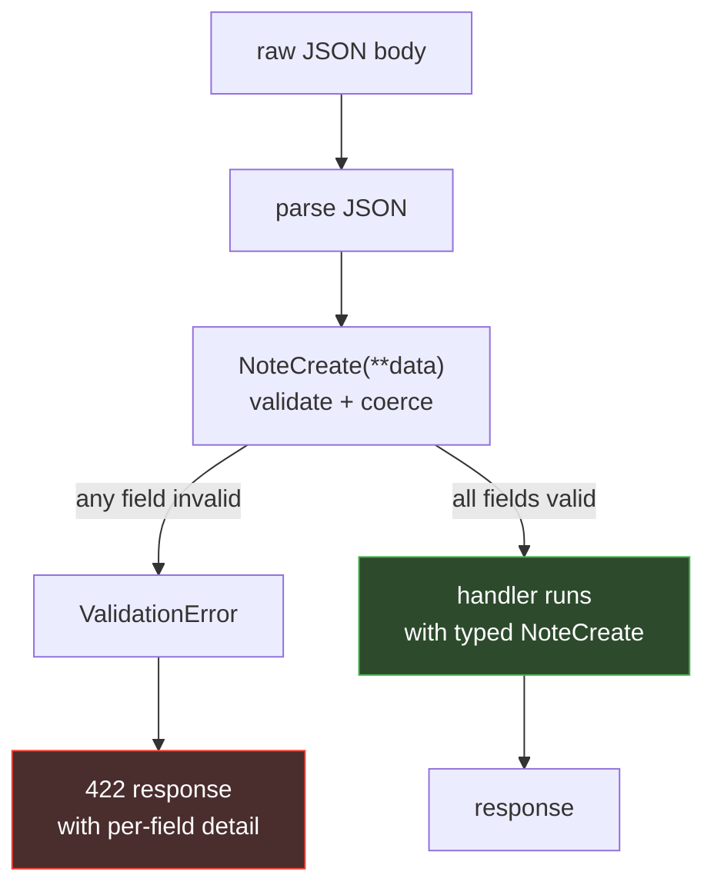

# Topic 1 — The Request Lifecycle & Type-Driven Validation

This topic explains **how a request becomes a response in FastAPI**, and why type hints
are the center of gravity of the whole framework. By the end you should be able to look
at any endpoint and predict exactly what FastAPI does with each parameter.

> ▶ **Run the code:** [`code/topic-1/`](../code/topic-1/) is the working single-file app for
> this topic. Practice: [`exercises/ex1_search_endpoint`](../exercises/ex1_search_endpoint/).

---

## 1. The ASGI foundation

Before any of your code runs, there's a server: **[Uvicorn](./glossary.md#uvicorn)**. It's
an *[ASGI](./glossary.md#asgi)* server — Asynchronous Server Gateway Interface — the async
successor to Python's older [WSGI](./glossary.md#wsgi) standard.

An ASGI application is, at its core, a single async callable with a fixed signature:

```python
async def app(scope, receive, send):
    ...
```

- `scope` — a dict describing the connection (type, path, headers, method).
- `receive` — an async function you call to get incoming events (the request body).
- `send` — an async function you call to push events out (the response).

You will almost never write this by hand. FastAPI *is* an object that implements this
signature. When you write `app = FastAPI()`, you're creating an ASGI application; when you
run `uvicorn main:app`, Uvicorn imports that object and calls it once per request.

**Why this matters for a Node developer:** in Express, the framework and the HTTP server
are tangled together — `app.listen()` starts a server. In the Python world they're
cleanly separated. Your FastAPI code has *no idea* what server runs it. You could swap
Uvicorn for Hypercorn or Daphne without touching a line. This separation is why FastAPI
apps are so easy to test — you can call the app directly, no socket required (see Topic 3).

### The layers a request passes through

```
request → [Uvicorn parses HTTP]
        → [routing: match path + method]
        → [dependency resolution]           ← Topic 2
        → [parameter extraction + validation]   ← this topic
        → [your handler function runs]
        → [response model validation + serialization]
        → [Uvicorn writes HTTP] → response
```

The two boxes this topic focuses on are **validation** (in) and **serialization** (out).
Both are driven entirely by type hints.

---

## 2. Routing: decorators as registration

```python
from fastapi import FastAPI

app = FastAPI()


@app.get("/notes")
async def list_notes():
    return {"notes": []}
```

`@app.get("/notes")` is a **decorator** — a function that takes your handler and registers
it. It's equivalent to Express's `app.get("/notes", handler)`; the decorator syntax just
moves the registration above the function instead of wrapping it in a call.

The important conceptual difference is what happens *after* registration. In Express, your
handler receives `(req, res, next)` and you pull everything off `req` manually. In FastAPI,
**the framework inspects your function signature** and decides how to supply each argument.
That inspection is the heart of the framework.

### Why `async def`? (and when a plain `def` is fine)

Every handler so far is `async def`, which a JS developer will read as normal — in Node
almost everything is async. But FastAPI accepts **both** `async def` and plain `def`
handlers, and the distinction matters:

- Use **`async def`** when the work inside is itself asynchronous — you `await` an async
  database driver, an `httpx` call, another coroutine.
- Use **plain `def`** when the work is blocking or synchronous (a sync DB library, CPU
  work). FastAPI runs `def` handlers in a **thread pool**, so they don't block the server.

The one thing to avoid: a *blocking* call inside an `async def`. That runs on the event
loop and stalls every other in-flight request. If you're calling something synchronous and
can't await it, a plain `def` handler is the safer choice.

For Topic 1 that's all you need — write `async def` and `await` your async calls. The full
concurrency model (the event loop, why this isn't about raw speed) is covered in
[Topic 3](./session-3.md#7-the-async-performance-model-a-common-misconception).

---

## 3. Parameters: where do arguments come from?

Given a handler, FastAPI looks at each parameter and classifies it by **type and
location**. This is entirely automatic and rule-based:

```python
from pydantic import BaseModel


class NoteCreate(BaseModel):
    title: str
    done: bool = False


@app.post("/notes/{note_id}")
async def update(note_id: int, verbose: bool = False, payload: NoteCreate = None):
    ...
```

FastAPI resolves those three parameters like this:

| Parameter | How it's classified | Source |
|-----------|--------------------|--------|
| `note_id: int` | name appears in the path `{note_id}` | **path parameter** |
| `verbose: bool = False` | scalar type, not in path, has default | **query parameter** |
| `payload: NoteCreate` | type is a Pydantic model | **request body** (JSON) |

The rules, stated plainly:

- **If the name is in the path template**, it's a path parameter.
- **Otherwise, if the type is a scalar** (`int`, `str`, `bool`, `float`), it's a query
  parameter.
- **If the type is a Pydantic model**, it's parsed from the JSON request body.
- Special types (`Header`, `Cookie`, `Depends`, `UploadFile`, …) override these defaults.

**Contrast with Node:** `req.params.note_id` is always the string `"5"`; you'd write
`Number(req.params.note_id)` and then guard against `NaN`. In FastAPI, `note_id: int`
means the value arrives already parsed to an `int`, and if it can't be parsed the request
never reaches your function — it's rejected with a `422` automatically.

### Attaching metadata: the `Annotated` idiom

Bare types cover the common case, but often you need to attach *constraints or
documentation* to a parameter — a maximum length, a description, a default with validation.
The modern, recommended way is Python's `Annotated`, which pairs a type with metadata:

```python
from typing import Annotated
from fastapi import Query


@app.get("/notes")
async def search(
    q: Annotated[str, Query(min_length=1, max_length=50, description="search term")],
    limit: Annotated[int, Query(ge=1, le=100)] = 20,
):
    ...
```

`Annotated[str, Query(...)]` reads as "a `str`, and here is extra information about it."
You'll see an older style in tutorials — `q: str = Query(min_length=1)` — where the
`Query(...)` sits in the *default* slot. Both work, but prefer `Annotated` because:

- The **type stays the type** and the default stays a real default (`= 20` above is an
  honest default value, not a `Query` object masquerading as one).
- The **same annotation is reusable** — you can hoist `Annotated[str, Query(...)]` into a
  named type alias and share it across endpoints.
- It's what current FastAPI documentation and the ecosystem have standardized on.

The same pattern applies to `Path()`, `Header()`, `Cookie()`, and — importantly —
`Depends()` (Topic 2): `session: Annotated[Session, Depends(get_session)]`.

### Request data that isn't a JSON body

Section 3's rules cover path params, query params, and a JSON body — the common case. But
the same "it's just a typed parameter" idea extends to every other place data can arrive.
You pick the source with a marker, exactly like `Query`:

```python
from typing import Annotated
from fastapi import Form, File, UploadFile, Header, Cookie


@app.post("/login")
async def login(
    username: Annotated[str, Form()],       # from an x-www-form-urlencoded body
    password: Annotated[str, Form()],
):
    ...


@app.post("/upload")
async def upload(file: Annotated[UploadFile, File()]):   # multipart file upload
    data = await file.read()                # UploadFile streams via a temp file
    return {"name": file.filename, "size": len(data)}


@app.get("/whoami")
async def whoami(
    user_agent: Annotated[str | None, Header()] = None,   # the User-Agent header
    session_id: Annotated[str | None, Cookie()] = None,   # a request cookie
):
    ...
```

Points worth knowing:

- **`Form()` and JSON are mutually exclusive** in one endpoint — a request body is either
  form-encoded or JSON, not both. Form/file support needs the `python-multipart` package
  (bundled with `fastapi[standard]`).
- **`UploadFile`** doesn't load the whole file into memory; it streams to a spooled temp
  file, so it handles large uploads. Use `bytes` instead only for small files.
- **`Header()` maps names automatically**: the parameter `user_agent` binds to the
  `User-Agent` header (underscore ↔ hyphen, case-insensitive).
- Every one of these is still validated and documented like any other parameter — a missing
  required `Form` field is a `422`, and the upload/form shows up in `/docs` with the right
  input widget.

*Node analogy:* this replaces reaching into `req.body` (with `multer` for files),
`req.headers`, and `req.cookies` — but here each is a declared, typed, validated parameter.

> ▶ **Run it:** [`code/topic-1/request_data.py`](../code/topic-1/) has working form/upload/
> header/cookie endpoints, with [`test_request_data.py`](../code/topic-1/) as the spec.

---

## 4. Pydantic: types that exist at runtime

This is the concept that reframes everything for a JS/TS developer.

In TypeScript, a type is a *compile-time* fiction. After `tsc` runs, the types are gone;
at runtime a value typed `number` might be a string that slipped through an `any`. To get
runtime safety you reach for a *second* tool — Zod, Yup, io-ts — and write the schema
again in that tool's DSL.

Pydantic collapses these into one. A `BaseModel` is:

- a **type** you can annotate with and get editor autocomplete, and
- a **runtime validator** that [parses, coerces](./glossary.md#coercion), and rejects bad
  data, and
- a **schema** that FastAPI turns into [OpenAPI](./glossary.md#openapi)/JSON Schema
  documentation.

```python
from pydantic import BaseModel, Field


class NoteCreate(BaseModel):
    title: str = Field(min_length=1, max_length=200)
    done: bool = False
    tags: list[str] = []
```

### What actually happens when a body arrives

When a request hits `POST /notes` with a JSON body, FastAPI:

1. Reads the raw bytes and parses JSON.
2. Constructs `NoteCreate(**data)`. Pydantic runs **validation**: checks `title` is a
   string of the right length, `done` is a bool, `tags` is a list of strings.
3. Performs **coercion** where sensible: the string `"true"` in a form becomes `True`;
   `"5"` for an `int` field becomes `5`. (Coercion rules are strict for JSON bodies and
   looser for query/path where everything starts as a string.)
4. If any check fails, it raises a `ValidationError`, which FastAPI catches and turns into
   a **422 Unprocessable Entity** response with a precise, machine-readable error body —
   listing every failed field, its location, and why.
5. Only if everything passes does your handler run, receiving a fully-typed `NoteCreate`
   instance.

The mental model: **validation happens before your code, not inside it.** You never write
`if not isinstance(title, str): return 400`. The type declaration is the check.



Your handler sits on the green path only. The red path — bad input — never reaches your
code; FastAPI has already answered the client.

### The 422 error shape

A rejected request returns something like:

```json
{
  "detail": [
    {
      "type": "string_type",
      "loc": ["body", "title"],
      "msg": "Input should be a valid string",
      "input": 123
    }
  ]
}
```

`loc` tells the client *exactly* where the problem is (`body` → `title`). This is a real
maintenance benefit: your API's error contract is consistent and detailed for free, across
every endpoint, forever.

### 4.1 Field constraints and enums — validation richer than the type

A type says "this is a string." Often you need more: "a non-empty string of at most 200
characters," or "one of exactly these values." Pydantic's `Field` and Python's `Enum`
express that, and — like everything else — the rules are enforced at runtime *and* published
to the docs.

```python
from enum import Enum
from pydantic import BaseModel, Field


class Priority(str, Enum):        # a str Enum: value must be one of these members
    low = "low"
    medium = "medium"
    high = "high"


class TaskCreate(BaseModel):
    title: str = Field(min_length=1, max_length=200)
    priority: Priority = Priority.medium
    due_days: int | None = Field(default=None, ge=0, le=365)   # 0 ≤ due_days ≤ 365
```

- **`Field(min_length=, max_length=, ge=, le=, gt=, lt=, pattern=)`** attaches constraints.
  A violation is a `422` with a message naming the constraint — you write no `if` checks.
- **A `str, Enum`** restricts a value to a fixed set. Send `"urgent"` and it's rejected;
  the docs render it as a **dropdown** of the allowed values.
- Pydantic also ships semantic types like `EmailStr` and `HttpUrl` that validate format.

*Node analogy:* this is exactly a Zod schema's `.min()`, `.max()`, `.email()`, `z.enum([...])`
— but the same declaration is your type, your validator, and your docs.

### 4.2 Nested models, lists, and the optional-vs-required rules

Models compose. A field can be another model, or a list of them, and validation **recurses**:

```python
class Tag(BaseModel):
    name: str = Field(min_length=1, max_length=20)


class TaskCreate(BaseModel):
    title: str                       # required — no default
    priority: Priority = Priority.medium   # optional — has a default
    due_days: int | None = None      # optional AND may be explicitly null
    tags: list[Tag] = []             # a list of nested models
```

Sending `{"tags": [{"name": ""}]}` fails, because each `Tag` is validated too — the error
`loc` will be `["body", "tags", 0, "name"]`, pointing at the exact element.

The **required-vs-optional rules** trip up developers from loose JS objects, so state them
precisely:

| Declaration | Meaning |
|-------------|---------|
| `title: str` | **Required.** Omitting it is a 422. |
| `priority: Priority = Priority.medium` | **Optional.** Omitted → the default. |
| `due_days: int \| None = None` | **Optional**, and the client may send `null` explicitly. |
| `due_days: int \| None` (no default) | **Required**, but its value may be `null`. |

The key insight for a JS/TS developer: **`| None` (optional *type*) and having a default
(optional *field*) are two different things.** A field is optional in the request only if it
has a default. `int | None` without a default is still required — you just may pass `null`.

### 4.3 Custom validators — rules the type system can't express

Some rules aren't about a single field's type: "trim this and reject if blank,"
"end date must be after start date," "high-priority tasks need a due date." Pydantic gives
two hooks, both running *after* normal type validation:

```python
from pydantic import field_validator, model_validator


class TaskCreate(BaseModel):
    title: str
    priority: Priority = Priority.medium
    due_days: int | None = None

    @field_validator("title")
    @classmethod
    def title_not_blank(cls, v: str) -> str:
        v = v.strip()                     # you can NORMALIZE, not just check
        if not v:
            raise ValueError("title must not be blank")
        return v                          # returned value replaces the input

    @model_validator(mode="after")
    def high_priority_needs_due_date(self):
        if self.priority is Priority.high and self.due_days is None:
            raise ValueError("high-priority tasks require due_days")
        return self
```

- **`@field_validator("field")`** runs for one field. It can *transform* the value (return a
  cleaned version) as well as reject it. Great for trimming, lowercasing, canonicalizing.
- **`@model_validator(mode="after")`** runs once the whole model is built, so it can enforce
  **cross-field** rules — the thing a per-field type can never do.
- Raising `ValueError` inside either becomes a `422` with your message, consistent with
  every other validation error. You never touch the response yourself.

*Node analogy:* `@field_validator` ≈ Zod's `.transform()` / `.refine()` on one field;
`@model_validator` ≈ a `.superRefine()` over the whole object.

> ▶ **Run it:** [`code/topic-1/advanced_models.py`](../code/topic-1/) puts all three of the
> above (constraints, enum, nested models, both validator kinds) into one endpoint, and
> [`test_advanced_models.py`](../code/topic-1/) is the spec showing each rule in action.

---

## 5. `response_model`: validation on the way out

Type hints govern the response too. You can declare what an endpoint *returns*:

```python
class NoteRead(BaseModel):
    id: int
    title: str
    done: bool


@app.get("/notes/{note_id}", response_model=NoteRead)
async def get_note(note_id: int):
    return some_object_with_extra_fields  # only id/title/done are sent
```

`response_model` does two jobs:

- **Filtering** — any field on the returned object that isn't in `NoteRead` is stripped.
  This is a genuine security feature: if your DB row has a `password_hash` column and it
  isn't in the response model, it *cannot* leak, even if you forget.
- **Validation & documentation** — the response is validated against the model, and the
  model becomes the documented response schema in OpenAPI.

**The pattern this enables:** keep separate models for input, storage, and output. A
`NoteCreate` (no `id`), a `Note` table row (everything), and a `NoteRead` (safe public
fields). This separation is what lets your storage evolve without breaking your API
contract — a core maintainability idea explored in Topic 2.

### How Python types become JSON (serialization edge cases)

JSON has only strings, numbers, booleans, arrays, objects, and null — no `datetime`, no
`UUID`, no `Decimal`. Yet you can return those from a handler and FastAPI produces something
sensible. Knowing the exact conversions saves confusion (and surprises your frontend types):

| Python type | JSON output | Note |
|-------------|-------------|------|
| `datetime` / `date` | ISO 8601 string | e.g. `"2026-07-24T12:30:00"` |
| `UUID` | string | the canonical hyphenated form |
| `Decimal` | **string**, not a number | Pydantic v2 keeps it a string to preserve exact precision |
| `Enum` (e.g. `str, Enum`) | its `.value` | not the member name |
| `set` | array | JSON has no set type |
| `bytes` | string | decoded per the field config |

The `Decimal` one is the trap: developers expect `19.99` and get `"19.99"`. It's
deliberate — floats can't represent all decimals exactly (the classic `0.1 + 0.2` problem),
so Pydantic serializes `Decimal` as a string to avoid silent precision loss. If your
frontend needs a number, convert it there, or use a `float` field if exactness doesn't
matter.

This conversion is driven by the response's Pydantic model (or FastAPI's JSON encoder when
there's no model). You can customize it per field, but the defaults above are what you get
out of the box.

> ▶ **Run it:** [`code/topic-1/serialization.py`](../code/topic-1/) returns a model with all
> of these types; [`test_serialization.py`](../code/topic-1/) asserts the exact JSON output.

---

## 6. Status codes and errors

By default a successful handler returns `200` (or you set it: `status_code=201`). To fail
a request, you `raise` rather than `return`:

```python
from fastapi import HTTPException


@app.get("/notes/{note_id}")
async def get_note(note_id: int):
    note = lookup(note_id)
    if note is None:
        raise HTTPException(status_code=404, detail="Note not found")
    return note
```

`raise HTTPException(...)` is conceptually Nest's `throw new NotFoundException()`. FastAPI
catches it and produces `{"detail": "Note not found"}` with the right status. Because it's
an exception, it **short-circuits** — nothing after the `raise` runs, and it propagates up
through any dependencies cleanly. Topic 3 covers defining your own exception types and
centralized handlers.

---

## 7. OpenAPI: the documentation is a byproduct

Everything above — the parameter types, the Pydantic models, the status codes, the
response models — is metadata FastAPI already has in memory. So it generates an **OpenAPI
schema** (the modern name for Swagger) describing your entire API, served at
`/openapi.json`, and renders two interactive UIs at `/docs` and `/redoc`.

This is not a plugin or an annotation you add. It's a *consequence* of the type-driven
design: because the framework had to understand your types to validate them, it also knows
enough to document them. It's the equivalent of getting fully accurate Swagger docs with
zero decorators or JSDoc — the same declarations that run your validation also describe your
API.

OpenAPI itself is a **language-agnostic JSON description of your HTTP API** — an industry
standard hundreds of tools understand, not a FastAPI thing. Three URLs expose it:

| URL | What it serves | When you use it |
|-----|----------------|-----------------|
| `/openapi.json` | The raw OpenAPI document (JSON) | Machine consumption — codegen, CI checks |
| `/docs` | **Swagger UI** — interactive, "Try it out" | Exploring/calling the API while developing |
| `/redoc` | **ReDoc** — clean, read-only reference | Sharing polished docs with consumers |

`/docs` and `/redoc` render the *same* `/openapi.json`. If a field looks wrong in the UI, the
fix is always in your Python.

**Why this matters more to a JS developer than it first appears:** because `/openapi.json` is
a standard document, your frontend can **generate a fully typed TypeScript client** from it
(`openapi-typescript`, `orval`, `openapi-generator`). Add a field to a response model,
regenerate, and a mismatch becomes a *compile error* instead of a runtime surprise. The
schema is the contract, and it drives real tooling on both sides.

### Making the docs richer

The defaults are accurate but terse. Metadata that lives next to the code flows straight
into the schema:

```python
app = FastAPI(title="Notes API", version="1.0.0", description="A tiny notes service.")


@app.post(
    "/notes",
    status_code=201,
    summary="Create a note",          # one-line label in the endpoint list
    tags=["notes"],                    # groups endpoints under a heading
    responses={404: {"description": "Note not found"}},  # document other outcomes too
)
async def create_note(payload: NoteCreate):
    """Create a new note. This **docstring** becomes the long description (Markdown)."""
    ...
```

Quick reference for where things land: `FastAPI(title/version/description)` → the docs
header; `summary` → the endpoint's label; the **docstring** → its long description;
`tags` → section grouping; `Field(description=, examples=)` on models → per-field docs and
example values; `responses={...}` → additional documented status codes (the `422` for
validation errors is added automatically).

Finally, the schema is just data — `app.openapi()` returns it as a dict. Teams export it in
CI and diff it per PR to catch breaking API changes, or feed it to an API gateway. The docs
aren't a dead-end UI; they're an inspectable artifact your tooling can build on.

---

## Key takeaways

1. **Uvicorn runs your app; FastAPI *is* the ASGI app.** They're separate, which is why
   testing is easy.
2. **Type hints are the API.** Parameter types decide where values come from, how they're
   parsed, and how they're validated — before your code runs.
3. **Pydantic unifies TS-interface + Zod into one runtime-enforced thing.** Bad input is
   rejected with a precise 422 automatically.
4. **Validation goes deeper than types** — `Field` constraints, enums, nested models, and
   `@field_validator`/`@model_validator` cover everything from length limits to cross-field
   rules, all still surfacing as 422s and all documented.
5. **`response_model` filters and documents output**, enabling separate input/storage/output
   models.
6. **Docs are a free byproduct** of the type-driven design — a standard OpenAPI document at
   `/openapi.json`, rendered by Swagger UI (`/docs`) and ReDoc (`/redoc`), and rich enough to
   generate a typed client for your frontend.

### Concepts to explore further
- Pydantic's semantic types (`EmailStr`, `HttpUrl`, `constr`) for format-level validation.
- The difference between Pydantic's "strict" and "lax" coercion modes.
- Generating a typed TypeScript client from `/openapi.json` (`openapi-typescript`, `orval`).
- Exporting the OpenAPI schema in CI to diff it and catch breaking API changes.
