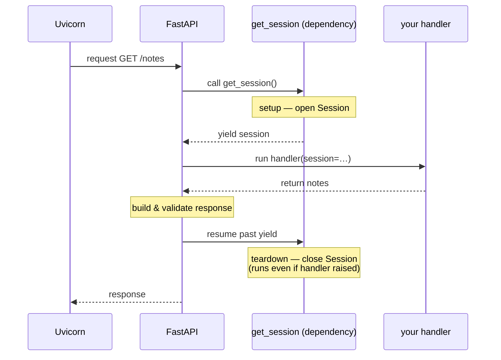
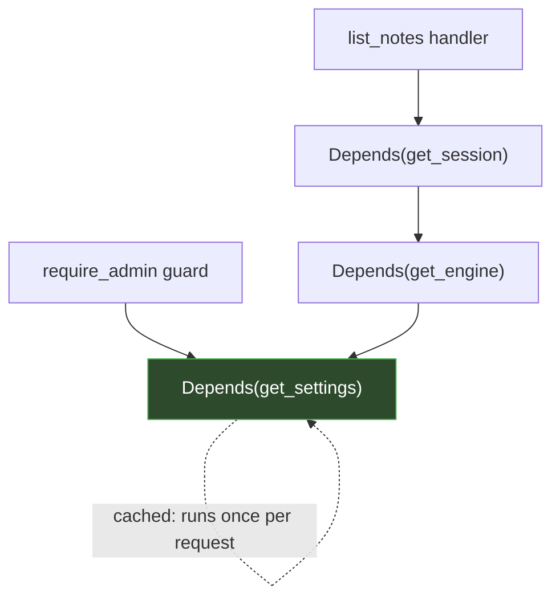

# Topic 2 — Architecture, Persistence & Dependency Injection

This topic explains how a FastAPI project is **structured** as it grows, how it talks to a
**database** through an ORM and sessions, and — most importantly — how FastAPI's
**dependency injection** works under the hood. Dependency injection is the concept with no
clean Express equivalent, so we spend the most time on its mechanics.

> ▶ **Run the code:** [`code/topic-2/`](../code/topic-2/) is the structured, database-backed
> app for this topic. Practice:
> [`exercises/ex2_owner_dependency`](../exercises/ex2_owner_dependency/).

---

## 1. Why structure matters, and the standard shape

A single `main.py` is fine for a demo and unmaintainable for a real app, for the same
reasons an Express monolith is: everything shares one namespace, routes and models and DB
code are tangled, and testing one piece means loading all of it.

The conventional FastAPI layout separates concerns by *kind*:

```
app/
├── __init__.py       # marks `app` as a package
├── main.py           # composition root: creates FastAPI(), wires routers
├── database.py       # engine + session factory (the DB connection layer)
├── models.py         # ORM table definitions (storage shape)
├── schemas.py        # Pydantic request/response models (API contract)
└── routers/
    ├── __init__.py
    └── notes.py      # endpoints for one resource
```

Two structural concepts worth understanding:

**Packages and `__init__.py`.** A folder with an `__init__.py` is a Python *package* —
importable as `app.routers.notes`. It's loosely analogous to an `index.js` barrel, but
it's what makes the dotted import path work at all. Without it, imports fail.

**The [composition root](./glossary.md#composition-root).** `main.py` is where the app is
*assembled* — it creates the `FastAPI()` instance and pulls in routers. Everything else is
a module that gets wired in. This mirrors the idea of a single entrypoint that imports your
Express routers.

### Routers: splitting the app by resource

```python
from fastapi import APIRouter

router = APIRouter(prefix="/notes", tags=["notes"])


@router.get("")
async def list_notes():
    ...
```

An `APIRouter` is a mountable group of routes — exactly like `express.Router()`. The
`prefix` is prepended to every path in the router, and `tags` group the endpoints in the
generated docs. In `main.py` you mount it:

```python
app.include_router(notes.router)
```

The design payoff: each resource lives in its own file, is independently testable, and the
composition root stays a readable table of contents.

---

## 2. The ORM: models, the engine, and sessions

FastAPI is database-agnostic. The common choice is **SQLAlchemy**, or **SQLModel** — a
thin layer by FastAPI's author that lets one class be *both* a SQLAlchemy table and a
Pydantic model. Conceptually this is your [ORM](./glossary.md#orm) — Prisma or Drizzle.

There are three distinct objects, and confusing them is the usual source of bugs:

### The engine — the connection pool

```python
from sqlmodel import create_engine

engine = create_engine("sqlite:///./notes.db", echo=True)
```

The **[engine](./glossary.md#engine-sqlalchemysqlmodel)** is created once for the whole
application. It's not a connection — it's a *factory and pool* of connections, managing the
actual sockets to the database. `echo=True` logs every SQL statement, which is invaluable
for learning what the ORM emits. Think of it
as the Prisma client instance you construct once and reuse.

### The model — a table definition

```python
from sqlmodel import SQLModel, Field


class Note(SQLModel, table=True):
    id: int | None = Field(default=None, primary_key=True)
    title: str
    done: bool = False
```

`table=True` tells SQLModel this class maps to a real table. `id` is `int | None` with a
default of `None` because the *database* assigns it on insert — before insertion, a new
`Note` has no id. This is your Prisma schema model, but expressed as a Python class.

### The session — a unit of work

```python
from sqlmodel import Session

with Session(engine) as session:
    session.add(note)
    session.commit()
```

The **session** is the concept JS ORMs mostly hide. A session is a short-lived *[unit of
work](./glossary.md#unit-of-work)*: it tracks the objects you've loaded and changed,
batches them, and flushes them to the database in a transaction on `commit()`. It is
**not** thread-safe and **not** meant to be long-lived — you create one per request and
discard it.

The lifecycle of an insert:

1. `session.add(note)` — the session now *tracks* this object (still in memory).
2. `session.commit()` — the session emits `INSERT`, the transaction commits.
3. `session.refresh(note)` — re-reads the row so `note.id` (assigned by the DB) is
   populated on your in-memory object.

**Why one session per request?** Because a session holds transaction state. Sharing one
across requests would mix unrelated work into one transaction and create race conditions.
This "one session per request" rule is *exactly* the problem dependency injection solves
next.

---

## 3. Dependency injection: the core of FastAPI

This is the framework's defining feature and the one with no direct Express analogue. Read
this section slowly.

### The problem it solves

Every endpoint that touches the database needs a session. That session must be:

- created fresh per request,
- cleaned up (closed) when the request ends, even if the handler raises,
- and *replaceable* in tests (with a session pointing at a test database).

In Express you'd attach it in middleware: `req.db = makeSession()`, then remember to close
it somewhere. That's imperative, easy to forget, and hard to swap in tests. FastAPI turns
this into a declarative, injectable value.

### How `Depends` works mechanically

A dependency is just a function. You declare that a handler *depends* on it:

```python
from fastapi import Depends
from sqlmodel import Session


def get_session():
    with Session(engine) as session:
        yield session


@router.get("/notes")
async def list_notes(session: Session = Depends(get_session)):
    return session.exec(select(Note)).all()
```

Here is the exact sequence FastAPI performs for each request to `/notes`:

1. It sees the parameter `session: Session = Depends(get_session)`. The `Depends(...)`
   marker tells it: *don't expect this from the request — produce it by calling
   `get_session`.*
2. It **calls `get_session()`**. Because the function uses `yield`, FastAPI runs it up to
   the `yield` and takes the yielded value (the open session).
3. It injects that session as the `session` argument and runs your handler.
4. After the response is produced, FastAPI **resumes `get_session` past the `yield`** —
   which exits the `with` block and closes the session. This teardown runs even if the
   handler raised.

Visually, the flow around the `yield` looks like this:



The `yield` is the key. A `yield`-based dependency is a **setup/teardown pair**: everything
before `yield` is setup, the yielded value is what's injected, and everything after `yield`
(including `with`/`finally` cleanup) is teardown that runs when the request finishes. It's
the dependency equivalent of `try/finally`.

### The difference from middleware, stated precisely

| | Express middleware | FastAPI `Depends` |
|---|---|---|
| Mechanism | mutates `req` as a side effect | returns/yields a value that's injected |
| Declaration | registered globally or per-route | declared in the handler's signature |
| Result | implicit (`req.whatever`) | explicit, typed parameter |
| Teardown | you manage it manually | automatic, via code after `yield` |
| Testability | monkeypatch `req` | first-class override (see below) |

Middleware *does something on the way in*. A dependency *is a value you asked for*. That
reframing — from "run this before my handler" to "compute this thing I need" — is the whole
idea.

### Dependencies compose and are cached

Dependencies can depend on other dependencies, forming a graph:

```python
def get_settings(): ...
def get_engine(settings = Depends(get_settings)): ...
def get_session(engine = Depends(get_engine)): ...
```

FastAPI resolves the whole graph per request. And within a single request, **a dependency
is cached**: if two things both depend on `get_settings`, it runs *once* and both get the
same value. This is important — it means dependencies are the natural place for
"compute-once-per-request" values (the current user, a DB session, a request-scoped config).

The graph, and the caching, look like this — note `get_settings` is reached by two paths
but executes only once:



Both `get_engine` (via `get_session`) and `require_admin` depend on `get_settings`, but
FastAPI computes it a single time and hands the same value to both.

### Dependencies as guards (side-effect-only)

A dependency doesn't have to return something you use. It can exist purely to *validate*:

```python
from fastapi import Header, HTTPException


def require_api_key(x_api_key: str | None = Header(default=None)):
    if x_api_key != "secret123":
        raise HTTPException(status_code=401, detail="Invalid API key")
    return x_api_key


@router.delete("/notes/{note_id}", dependencies=[Depends(require_api_key)])
async def delete_note(note_id: int):
    ...
```

Listing it in `dependencies=[...]` (rather than as a parameter) runs it for its side effect
— the guard — without injecting its return value. If it raises, the handler never runs.
This is the pattern real auth uses: the dependency decodes a JWT, validates it, and returns
the current user (which downstream handlers *do* inject).

**A subtle but important detail about validation order.** Note that `x_api_key` is declared
`str | None` with a default. If you instead made it *required* (`x_api_key: str =
Header()`), then a request with **no header at all** would fail FastAPI's parameter
validation with a **422** — *before* your `if` check runs — because a required header is
part of the request contract. A *present but wrong* key gives your intended 401. This is a
concrete illustration of the layering from Topic 1: **parameter validation happens before
your dependency body executes.** Making the parameter optional hands you control of the
status code.

---

## 4. Startup and shutdown: the lifespan

Some setup must happen once when the app boots — creating tables, opening a connection
pool, warming a cache — and be torn down on shutdown. FastAPI models this with a
**[lifespan](./glossary.md#lifespan) context manager**:

```python
from contextlib import asynccontextmanager
from fastapi import FastAPI


@asynccontextmanager
async def lifespan(app: FastAPI):
    init_db()      # runs once on startup (create tables, etc.)
    yield          # ← the application runs for as long as this is suspended
    # cleanup here runs once on shutdown


app = FastAPI(lifespan=lifespan)
```

The same `yield` idea as dependencies, but at *application* scope instead of *request*
scope: everything before `yield` runs at startup, the app serves requests while suspended
at the `yield`, and everything after runs at shutdown. This is the direct analogue of
setting up before `server.listen()` and tearing down on `server.close()`.

---

## 5. Why separate `models` from `schemas`

It's tempting to use one class for everything. Keeping the **table model** (`models.py`)
separate from the **API schemas** (`schemas.py`) is a deliberate maintainability decision:

- The table model is your *storage* shape — it has an `id`, timestamps, foreign keys,
  maybe a `password_hash`.
- `NoteCreate` is the *input* contract — no `id` (the DB assigns it), no server-controlled
  fields.
- `NoteRead` is the *output* contract — only the fields safe to expose.

Because these are separate, you can add a column to the table, change how data is stored,
or add an internal field **without changing what clients send or receive**. The API
contract and the storage schema evolve independently. This is the structural reason FastAPI
apps stay maintainable as they grow, and it's why `response_model` (Topic 1) matters.

---

## Key takeaways

1. **Structure by kind** — routers, models, schemas, database — with `main.py` as the
   composition root. `__init__.py` makes folders importable packages.
2. **Engine ≠ connection ≠ session.** The engine is a once-per-app pool; the session is a
   per-request unit of work that must not be shared.
3. **`Depends` computes and injects values**, resolving a cached graph per request, with
   `yield` providing automatic teardown. It's injection, not middleware mutation.
4. **Dependencies double as guards** and are the home of auth.
5. **`lifespan` is startup/shutdown** at app scope — the same `yield` pattern, one level up.
6. **Separate storage models from API schemas** so the two can evolve independently.

### Concepts to explore further
- Alembic for migrations (your `prisma migrate`) once the schema starts changing.
- Async database drivers (`asyncpg`) and `AsyncSession` for true async DB I/O.
- Sub-dependencies and `Depends` caching for request-scoped shared state.
