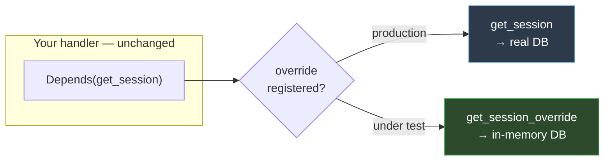

# Topic 3 — Configuration, Errors, Testing & Deployment

This topic covers the concerns that separate a demo from a maintainable service:
**configuration** that's validated and environment-aware, **error handling** that's
consistent, **testing** that's fast and isolated, and **containerization** for reproducible
deployment. The testing section is the conceptual heart — it's where the dependency
injection from Topic 2 pays off.

> ▶ **Run the code:** [`code/topic-3/`](../code/topic-3/) is the production-ready app for
> this topic (config, JWT auth, CORS, tests, Docker). Practice:
> [`exercises/ex3_health_and_update`](../exercises/ex3_health_and_update/).

---

## 1. Configuration as validated data

Hardcoded values (a database URL, an API key) are fine on your laptop and dangerous in
production, for the obvious reason that different environments need different values and
secrets must not live in source. In Node you reach for `dotenv` to load a `.env` file, and
perhaps a Zod schema to validate the result.

`pydantic-settings` does both at once, reusing the same validation engine as your request
models:

```python
from pydantic_settings import BaseSettings, SettingsConfigDict


class Settings(BaseSettings):
    database_url: str = "sqlite:///./notes.db"
    api_key: str
    debug: bool = False

    model_config = SettingsConfigDict(env_file=".env")


settings = Settings()
```

What happens when `Settings()` is constructed:

1. For each field, it looks for a matching **environment variable** (case-insensitive:
   `database_url` ← `DATABASE_URL`).
2. If not found in the environment, it falls back to the `.env` file, then to the field's
   default.
3. It **validates and coerces** each value with Pydantic. `debug` reads the string
   `"true"` from the environment and produces the bool `True`. `api_key` has no default, so
   if it's missing the app **refuses to start** with a clear error.

That last point is the key idea: **misconfiguration fails loudly at startup, not
mysteriously at request time.** A missing secret is caught the moment the process boots,
not three hours later when the first request that needs it arrives. This is the same
"validate at the boundary" philosophy as request validation, applied to config.

**Operational note:** never commit `.env`. Add it to `.gitignore` and commit a
`.env.example` with dummy values so the required keys are documented. Because `Settings`
reads the real environment first, production can inject values via the platform (container
env vars, a secrets manager) with no file at all — and no code change.

---

## 2. Error handling: from ad-hoc to centralized

Topic 1 covered `raise HTTPException(status_code=404, detail="...")`. That's the right tool
for one-off errors. But as an app grows you want *domain* errors — meaningful exception
types — and one place that decides how each maps to an HTTP response. This is the analogue
of a global error-handling middleware in Express or an exception filter in Nest.

FastAPI lets you register a handler for any exception type:

```python
from fastapi import Request
from fastapi.responses import JSONResponse


class NoteNotFoundError(Exception):
    def __init__(self, note_id: int):
        self.note_id = note_id


@app.exception_handler(NoteNotFoundError)
async def note_not_found_handler(request: Request, exc: NoteNotFoundError):
    return JSONResponse(
        status_code=404,
        content={"error": f"Note {exc.note_id} does not exist"},
    )
```

Now your business logic raises a *domain* exception — `raise NoteNotFoundError(note_id)` —
that knows nothing about HTTP. The handler is the single place that translates it into a
status code and response shape. The benefits:

- **Uniform error shape** across the whole API, defined once.
- **Separation of concerns** — your service layer speaks in domain errors, not HTTP codes.
- **Easy to change** — adjust the response format in one function, not at every raise site.

This is the same reasoning behind Nest's exception filters: keep the "what went wrong"
(the exception) separate from the "how do we tell the client" (the handler).

---

## 3. Testing: the payoff for dependency injection

This is the most important section. It's where the architecture from Topic 2 proves its
worth.

### Why FastAPI apps are easy to test

Recall from Topic 1 that Uvicorn (the server) and FastAPI (the app) are separate, and the
app is just an ASGI callable. That means you can drive the app **in-process, without a
running server or a real socket** — you construct requests and call the app directly.

`TestClient` does exactly this. It's your Supertest:

```python
from fastapi.testclient import TestClient
from app.main import app

client = TestClient(app)


def test_create_note():
    response = client.post("/notes", json={"title": "Write tests"})
    assert response.status_code == 201
    assert response.json()["title"] == "Write tests"
```

`client.post(...)` synthesizes a full request, runs it through the *entire* real stack —
routing, validation, dependencies, your handler, serialization — and hands back the
response. No network, no server startup, milliseconds per test. The test runner is
**pytest** (your Jest).

### The isolation problem

The test above works, but it writes to your *real* database. That's wrong: tests must be
isolated and repeatable, not dependent on or mutating real data. In many frameworks this is
where testing gets painful — you mock the database module, or spin up a real DB and reset
it between tests.

FastAPI solves it structurally, because of one decision from Topic 2: your handlers get
their session via `Depends(get_session)` rather than importing it directly.

### Dependency overrides

Every FastAPI app has a `dependency_overrides` dict. It maps *a dependency function* to *a
replacement*. When FastAPI is about to call `get_session`, it first checks this dict; if
there's an override, it calls that instead. Your application code is untouched — it still
asks for `Depends(get_session)` — but in tests that resolves to a different implementation.

```python
import pytest
from fastapi.testclient import TestClient
from sqlmodel import SQLModel, Session, create_engine
from sqlmodel.pool import StaticPool

from app.main import app
from app.database import get_session


@pytest.fixture(name="client")
def client_fixture():
    # A fresh in-memory database, isolated per test
    engine = create_engine(
        "sqlite://",                       # in-memory: nothing touches disk
        connect_args={"check_same_thread": False},
        poolclass=StaticPool,              # one shared connection for the test
    )
    SQLModel.metadata.create_all(engine)

    def get_session_override():
        with Session(engine) as session:
            yield session

    # The key line: swap the real session dependency for the test one
    app.dependency_overrides[get_session] = get_session_override

    yield TestClient(app)

    app.dependency_overrides.clear()       # reset so tests don't leak
```

The mechanism, spelled out:

- The real `get_session` yields a session bound to the production engine.
- The override yields a session bound to a **throwaway in-memory SQLite** database, created
  fresh for each test.
- `app.dependency_overrides[get_session] = get_session_override` tells FastAPI to
  substitute one for the other during resolution.
- Every endpoint that does `Depends(get_session)` now transparently gets the test session —
  **without any change to the application code.**

That is the whole reason Topic 2 insisted on injecting the session rather than importing it.
Injection is what makes substitution possible. A test using the fixture:



The handler always asks for the same thing; only what that request *resolves to* changes.

```python
def test_create_and_read(client):
    created = client.post("/notes", json={"title": "x"})
    assert created.status_code == 201

    note_id = created.json()["id"]
    fetched = client.get(f"/notes/{note_id}")
    assert fetched.json()["title"] == "x"


def test_missing_note_404(client):
    assert client.get("/notes/999").status_code == 404
```

### pytest fixtures, briefly

A `@pytest.fixture` is pytest's dependency injection for *tests* — a function that produces
a value (and optionally tears it down, again via `yield`). A test that takes a parameter
named `client` gets the fixture's yielded value. It's the same setup/teardown-around-`yield`
pattern you've now seen three times: in route dependencies, in the app lifespan, and here in
test fixtures. Recognizing that shared pattern is worth more than memorizing any one API.

---

## 4. CORS: the first wall a frontend hits

The moment a browser-based frontend (React, Vue, plain `fetch`) calls your API from a
*different origin* — say the app runs on `localhost:5173` and the API on `localhost:8000` —
the browser enforces **CORS** (Cross-Origin Resource Sharing). If your API doesn't return
the right headers, the browser blocks the response and the developer sees a console error
like *"No 'Access-Control-Allow-Origin' header is present."*

This is not a FastAPI-specific problem — it's how browsers work — but it's the first thing
a JS developer trips on, because a request that works fine from `curl` or `/docs` fails
from the browser. `curl` doesn't enforce CORS; browsers do.

FastAPI handles it with a **middleware** (yes, FastAPI has middleware too, for
cross-cutting concerns like this that genuinely wrap every request):

```python
from fastapi.middleware.cors import CORSMiddleware

app.add_middleware(
    CORSMiddleware,
    allow_origins=["http://localhost:5173"],   # the frontend's origin(s)
    allow_credentials=True,
    allow_methods=["*"],                        # GET, POST, PUT, DELETE, …
    allow_headers=["*"],
)
```

Key points to understand rather than copy blindly:

- **`allow_origins` is an allowlist of origins, not a wildcard by default.** Listing your
  actual frontend origins is the correct, secure choice. Read the origins from
  configuration (section 1) so dev and prod differ by env var, not code.
- **`allow_origins=["*"]` and `allow_credentials=True` are mutually incompatible** — the
  browser rejects the combination. If you need cookies/credentials, you must name explicit
  origins.
- **Middleware vs. dependencies:** CORS is a legitimate use of middleware because it
  genuinely wraps *every* request/response to add headers. Contrast with Topic 2's point
  that per-endpoint *values* belong in dependencies, not middleware. Both mechanisms exist;
  use middleware for true cross-cutting concerns, dependencies for injected values.

---

## 5. Real authentication: `OAuth2PasswordBearer` and JWTs

Topic 2 showed a dependency guarding a route with a static API key, and noted "real apps
decode a JWT here." Here's what that actually looks like, because it's what you'll reach
for in week one.

The building block is `OAuth2PasswordBearer` — a dependency that extracts a bearer token
from the `Authorization: Bearer <token>` header (and wires up the `/docs` "Authorize"
button for free):

```python
from typing import Annotated
from fastapi import Depends, HTTPException
from fastapi.security import OAuth2PasswordBearer
import jwt   # from the PyJWT package

oauth2_scheme = OAuth2PasswordBearer(tokenUrl="token")


def get_current_user(token: Annotated[str, Depends(oauth2_scheme)]):
    try:
        payload = jwt.decode(token, settings.jwt_secret, algorithms=["HS256"])
    except jwt.PyJWTError:
        raise HTTPException(status_code=401, detail="Invalid token")
    return payload["sub"]        # e.g. the user id encoded in the token
```

Then any endpoint that needs a logged-in user simply *asks for one*:

```python
@router.get("/notes")
async def list_notes(current_user: Annotated[str, Depends(get_current_user)]):
    ...   # current_user is guaranteed valid, or the request already 401'd
```

The conceptual point — and why this belongs in a doc about *maintainability* — is that
**authentication is just another dependency.** It composes with everything from Topic 2:

- It's declared in the signature, so it's explicit which endpoints require auth.
- It's cached per request, so decoding happens once even if several dependencies need the
  user.
- It's **overridable in tests** exactly like the DB session — override `get_current_user`
  to return a fake user and you can test protected endpoints without minting real tokens.

Login itself (issuing the token) is the mirror image: an endpoint that verifies a
username/password (hash comparison with `passlib`), then returns a signed JWT via
`jwt.encode(...)`. The token secret comes from `settings` (section 1), never hardcoded.

> **Scope note:** the crypto details (algorithm choice, token expiry, refresh tokens,
> password hashing) are a topic of their own. The point here is *structural*: auth in
> FastAPI is a dependency, so it inherits injection, caching, and testability for free.

---

## 6. Containerization: reproducible deployment

Docker packages your app with its exact runtime and dependencies so it runs identically
everywhere. If you've containerized a Node app, the concepts transfer directly; only the
commands differ.

```dockerfile
FROM python:3.14-slim

WORKDIR /code

# Copy dependency manifest first, install — this layer is cached
COPY requirements.txt .
RUN pip install --no-cache-dir -r requirements.txt

# Then copy source. Changing source doesn't invalidate the deps layer above.
COPY ./app ./app

EXPOSE 8000
CMD ["uvicorn", "app.main:app", "--host", "0.0.0.0", "--port", "8000"]
```

Two concepts worth internalizing:

**Layer caching and ordering.** Docker builds in layers and caches each one. It rebuilds a
layer only if that layer or an earlier one changed. Copying `requirements.txt` and
installing *before* copying source means that editing your code — the frequent case —
reuses the cached dependency layer and rebuilds in seconds. This is the identical reasoning
to `COPY package.json` before `COPY . .` in a Node Dockerfile.

**`--host 0.0.0.0`.** Inside a container, binding to `127.0.0.1` (the default) makes the
server reachable *only from within the container*. `0.0.0.0` binds all interfaces so the
mapped port is reachable from the host. This trips up nearly everyone once.

### Multi-service with compose

Real apps have more than one process — the API plus a database. `docker-compose.yml`
declares them together:

```yaml
services:
  db:
    image: postgres:16
    environment:
      POSTGRES_USER: notes
      POSTGRES_PASSWORD: notes
      POSTGRES_DB: notes

  api:
    build: .
    ports:
      - "8000:8000"
    environment:
      DATABASE_URL: postgresql://notes:notes@db:5432/notes
    depends_on:
      - db
```

Note `@db:5432` in the URL — inside a compose network, services reach each other by
*service name* as hostname. And note what makes this clean: the API switches from SQLite to
Postgres purely by setting `DATABASE_URL`, because `Settings` reads that env var (section 1)
and the engine is built from it (Topic 2). **No application code changes to swap
databases.** That is the concrete reward for validated config plus injected dependencies —
the same app runs on SQLite locally and Postgres in production.

---

## 7. The async performance model (a common misconception)

Node developers assume `async` means "faster." It does not. `async` is about **concurrency**
— letting one worker make progress on many requests that are each *waiting* on I/O — not
about doing any single piece of work faster.

The mechanics: an `async def` handler runs on the [event loop](./glossary.md#event-loop).
When it `await`s genuine I/O (an async DB query, an `httpx` call), it yields control so the
loop can serve other requests while that I/O is in flight. This is efficient for I/O-bound
workloads.

The trap: if you call a **blocking** function — a synchronous DB driver, `time.sleep`, heavy
CPU work — inside an `async def`, it does *not* yield. It occupies the event loop and every
other in-flight request stalls until it returns. This is the single most common FastAPI
performance bug.

FastAPI gives you the escape hatch: a handler declared with plain `def` (not `async def`)
is run in a **thread pool**, so blocking code there doesn't freeze the loop. The practical
rule:

- Async libraries available → `async def`.
- Only blocking libraries available → plain `def` (FastAPI threads it for you).
- Never: a blocking call inside `async def`.

Understanding this prevents both the "why is my async app slow" surprise and the
over-application of `async` to code that gains nothing from it.

---

## 8. Troubleshooting: symptoms JS developers hit first

A lookup table for the errors that most reliably trip up someone arriving from Node. When
you see the symptom on the left, the cause is on the right.

| Symptom | Likely cause & fix |
|---------|--------------------|
| `ModuleNotFoundError: No module named 'app'` | Running from the wrong directory, or a folder is missing its `__init__.py`. Run from the project root and ensure every package folder has an (empty) `__init__.py`. |
| Browser: *"No 'Access-Control-Allow-Origin' header"* — but `curl`/`/docs` work fine | CORS. The request is cross-origin and the browser blocks it. Add `CORSMiddleware` with your frontend's origin (section 4). `curl` doesn't enforce CORS, which is why it "works." |
| `422 Unprocessable Entity` you didn't expect | A parameter/body failed **validation** before your code ran. Read the `detail[].loc` — it names the exact field. Often a required field is missing or the wrong type. See [Topic 1](./session-1.md#the-422-error-shape). |
| Missing required header returns **422**, you wanted **401** | A required `Header()` is validated as part of the request contract *before* your check. Make it `Optional`/`| None` with a default so your code controls the status. See [Topic 2](./session-2.md#dependencies-as-guards-side-effect-only). |
| The whole server freezes under load / one slow request blocks others | A **blocking** call inside an `async def` — it stalls the event loop. Either use an async library, or make the handler a plain `def` so FastAPI threads it (section 7). |
| `RuntimeError: ... greenlet_spawn / another operation is in progress` or session errors | Sharing one DB **session** across requests or threads, or using it after commit. Sessions are per-request — get them via `Depends(get_session)`, never a global. |
| `sqlalchemy ... no such table` | Tables were never created. Ensure `init_db()` runs in the **lifespan** on startup (Topic 2), or that migrations ran. |
| Response is missing fields you returned, or leaks fields you didn't want | `response_model` is filtering to the declared schema. Add the field to the response model, or (for leaks) that's the feature working — good. See [Topic 1](./session-1.md#5-response_model-validation-on-the-way-out). |
| `curl` POST gives `422` complaining about the body | You sent form data or forgot `Content-Type: application/json`. A Pydantic-model body expects JSON. Use `-H "Content-Type: application/json" -d '{...}'`. |
| Config value ignored / app uses the default | The env var name doesn't match the `Settings` field, or `.env` isn't being loaded. Names map case-insensitively (`DATABASE_URL` ← `database_url`); check `env_file` is set (section 1). |
| Editor shows type errors on `Depends(...)` defaults | Use the `Annotated` form — `x: Annotated[T, Depends(f)]` — which keeps the type honest and satisfies type checkers ([Topic 1](./session-1.md#attaching-metadata-the-annotated-idiom)). |
| Works in `/docs` but the "Authorize" button does nothing | You're using a custom header check instead of `OAuth2PasswordBearer`; only the latter wires up the docs auth UI (section 5). |

---

## Key takeaways

1. **`pydantic-settings` validates config at startup** — misconfiguration fails loudly and
   immediately, and environments differ by env var, not code.
2. **Centralized exception handlers** map domain errors to HTTP responses in one place,
   keeping business logic HTTP-agnostic.
3. **`TestClient` drives the real app in-process** (no server), and **`dependency_overrides`
   swaps the real DB for a test DB** — the direct payoff of injecting dependencies.
4. **Docker layer ordering** (deps before source) and **`0.0.0.0` binding** are the two
   container concepts that matter most; config + injection make DB swaps code-free.
5. **`async` is concurrency, not speed** — and a blocking call inside `async def` stalls the
   whole server.

### Concepts to explore further
- `BackgroundTasks` for work that should happen after the response is sent.
- Real authentication: JWT decoding in a dependency, password hashing with `passlib`.
- Alembic migrations and running them as a container startup step.
- Multiple Uvicorn workers / Gunicorn for using more than one CPU core.
